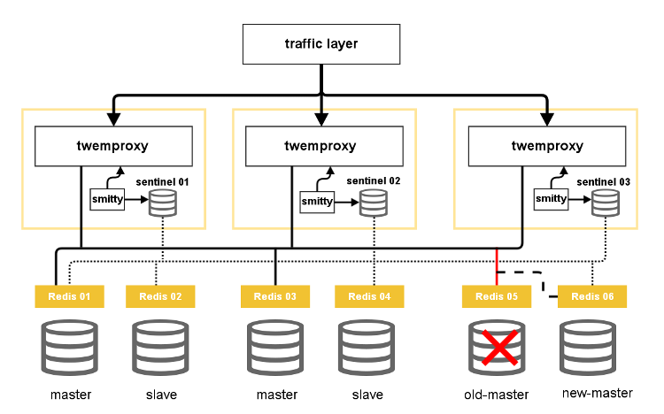

smitty
======

Smitty is an agent written in [Go](http://golang.org/) language for [twemproxy](https://github.com/twitter/twemproxy) configured to work with [redis
sentinel](http://redis.io/topics/sentinel). Smitty's purpose is to extend the HA capabilities of twemproxy even after a redis node has failed.

In order to accomplish this, smitty is continuously monitoring the **+switch-master** event, then it will update twemproxy configuration files and restart the resource.

### A possible scenario:

## Install

You can get the latest [release](https://github.com/areina/smitty/releases) that includes a smitty binary,
download and run it. 

## Configuration

smitty needs to be configured through a YAML file specified by the -c
command-line argument on process start. An example of configuration
file, also included in [conf/agent.yml](conf/agent.yml) could be this:

    twemproxy_pool_name: "root"
    twemproxy_config_file: "conf/nutcracker.yml"
    sentinel_ip: "127.0.0.1"
    sentinel_port: "26379"
    restart_command: "/etc/init.d/twemproxy restart"
    log_file: "agent.log"

## The name

At [3scale](http://3scale.net), we're an absolute Futurama fanatics, and of course there isn't a better name for an agent that Smitty:

## Contributing

1. Fork it
2. Create your feature branch (`git checkout -b my-new-feature`)
3. Commit your changes (`git commit -am 'Add some feature'`)
4. Push to the branch (`git push origin my-new-feature`)
5. Create new Pull Request

## License

Licensed under the Apache License, Version 2.0: http://www.apache.org/licenses/LICENSE-2.0

See [LICENSE.md](LICENSE)

test PR
